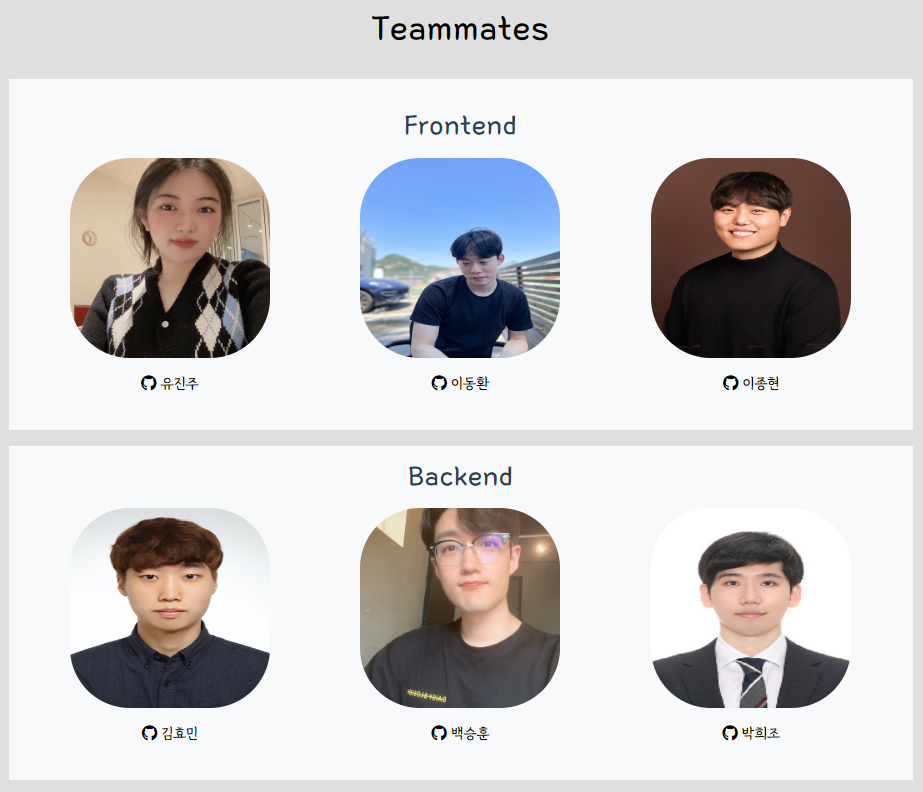
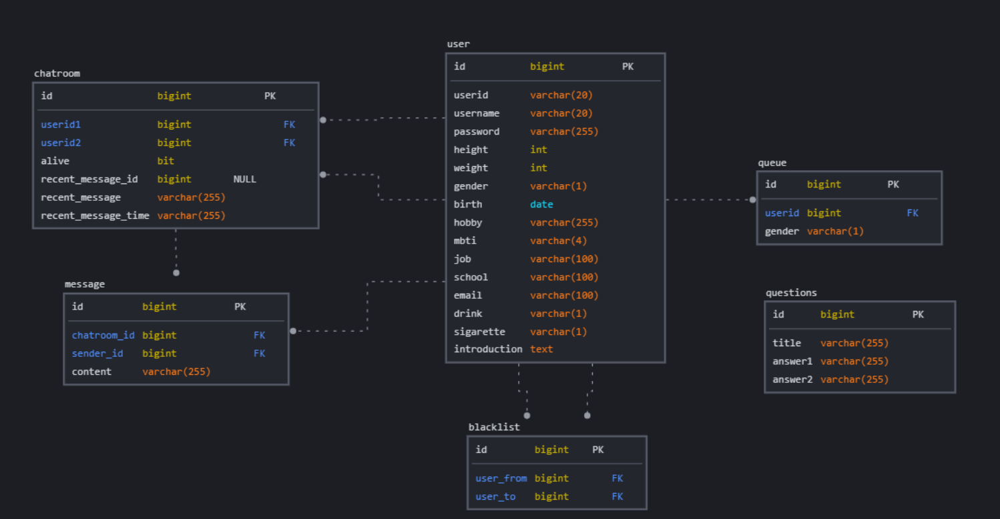
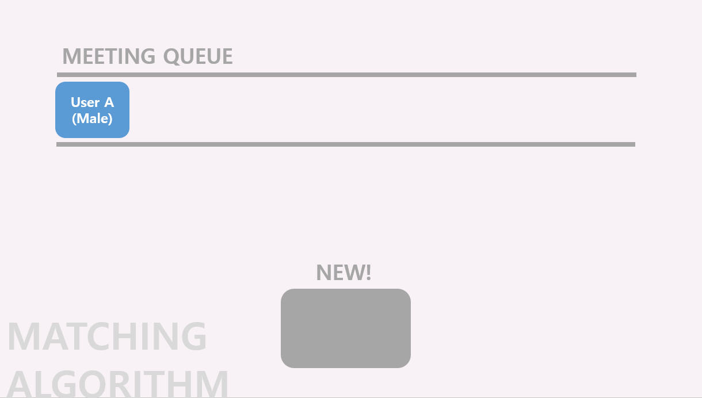
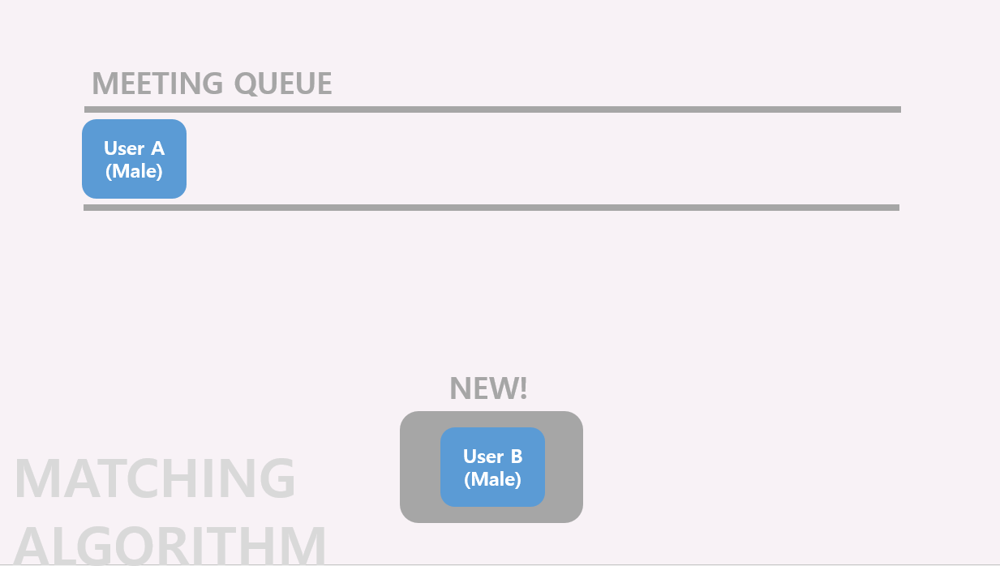
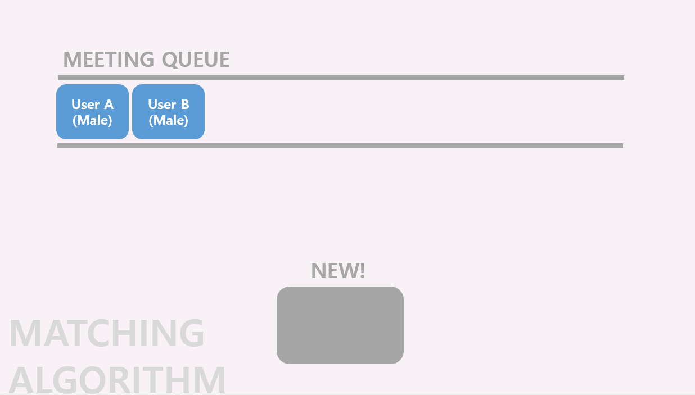
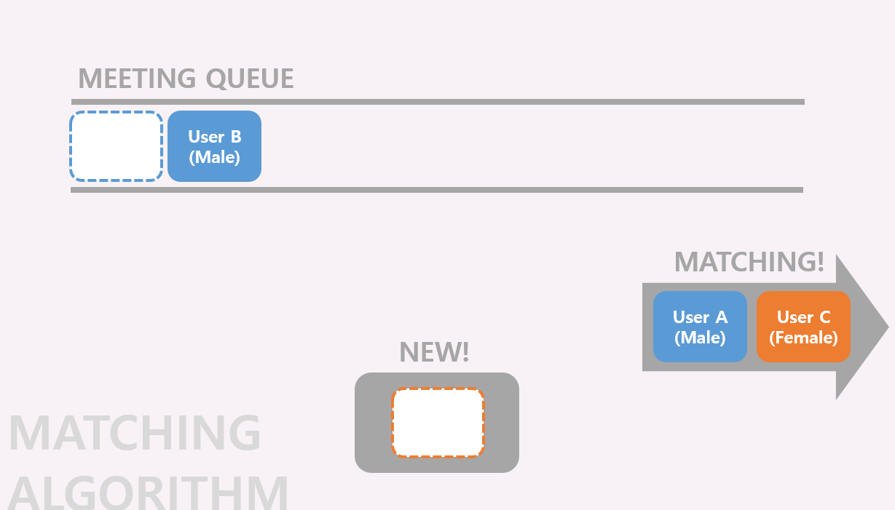
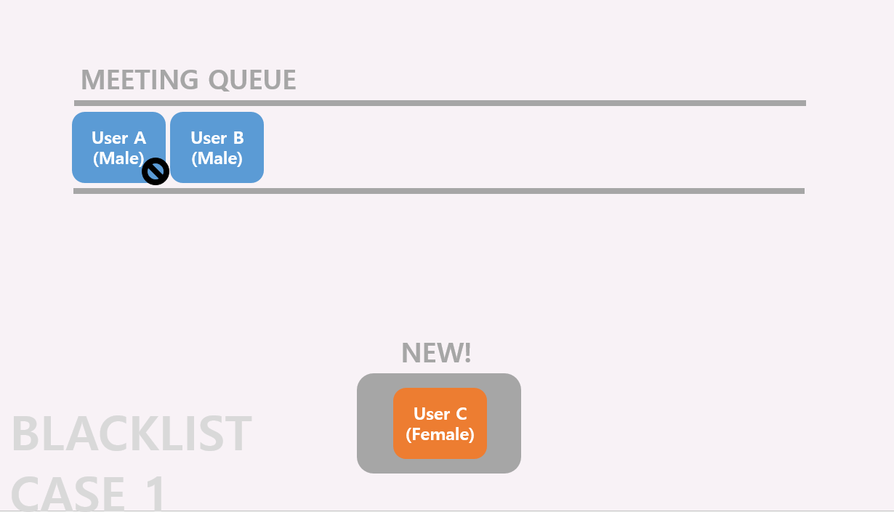
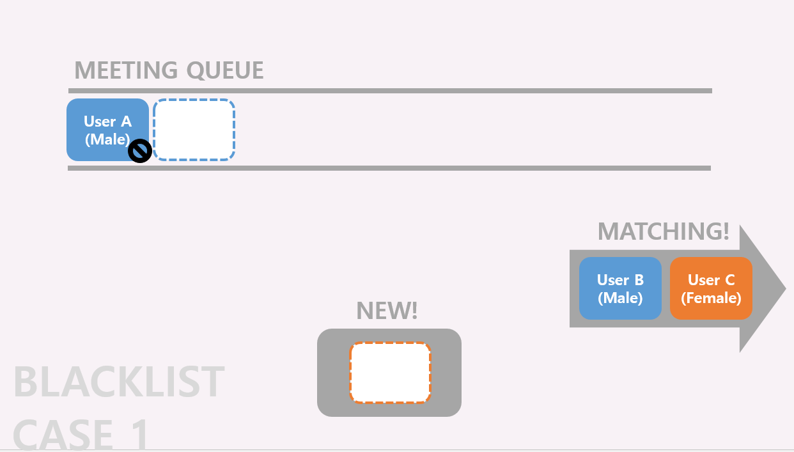
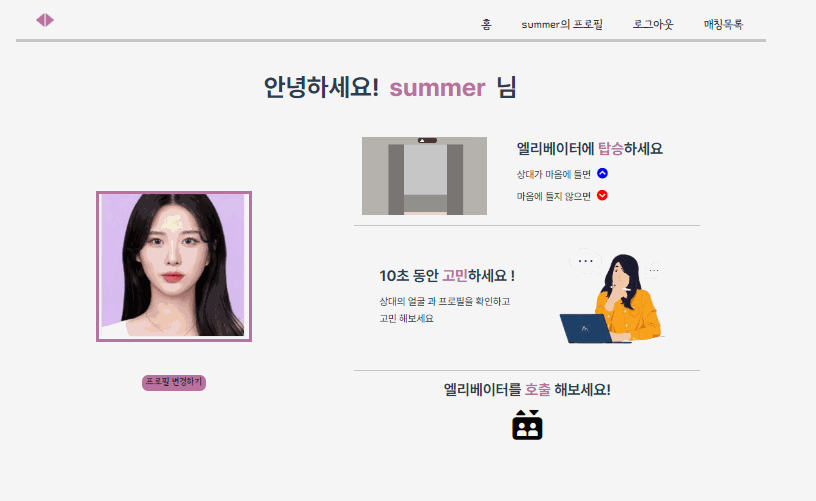

# SSAFY 2학기 관통 프로젝트 - 엘리베이터에서 우린 사랑을 나누지 (2022-07-05 ~ 2022-08-19)

 

## 1. :ledger: PJT summary

- 팀명: 일상정원
- 프로젝트명: 엘리베이터에서 우린 사랑을 나누지
- 주제: 1대1 소개팅 사이트
- 기간: 2022.07.05 (월) ~ 2022.08.19 (금)
- 발표: 08.19 (금)
- 조원: [김효민](https://github.com/kimhyomin97), [박희조](https://github.com/heejo17), [백승훈](https://github.com/seungHoon0422), [이동환](https://github.com/onghwand), [유진주](https://github.com/joo-jj), [이종현](https://github.com/jonghyunlee12)
- 사용기술스택:
  - 협업, 버전관리: 
  - 언어:  
  - FE/BE framework:> 
  - DB:     
  - 배포:   
  - 디자인: 

 

## :family: 2. 팀원 소개

 

## 🌲 3. Gitlab Conventions

#### branch tree

- master
  - develop
    - feature-chat
      - FE-chat
      - BE-chat
    - feature-accounts
      - FE-accounts
      - BE-accounts
    - feature-meeting
      - FE-meeting
      - BE-meeting

#### Commit Convention

- Fix : 잘못된 동작을 고칠 때

  > Fix typo in Home.vue

- Add : 새로운 것을 추가할 때

  > Add Detail.vue

- Remove : 삭제가 있을 때

  > Remove Detail.vue

- Update : 정상적으로 동작하는 파일을 보완하는 경우

  > Update login logic to accounts.js

 

## :four_leaf_clover: 4. ERD

 

## :female_detective: 5. 매칭 방법

- 다른 성별 1대1 매칭을 기본으로 하며, 블랙리스트를 이용하여 한 번 매칭된 상대와 다시 매치되는 것을 방지한다.	
  - 블랙리스트 : 매칭되었던 상대 리스트

> 블랙리스트가 없는 경우

> 블랙리스트가 있는 경우

 

## :package: 6. 결과 및 배포

> 홈

> 매칭

 