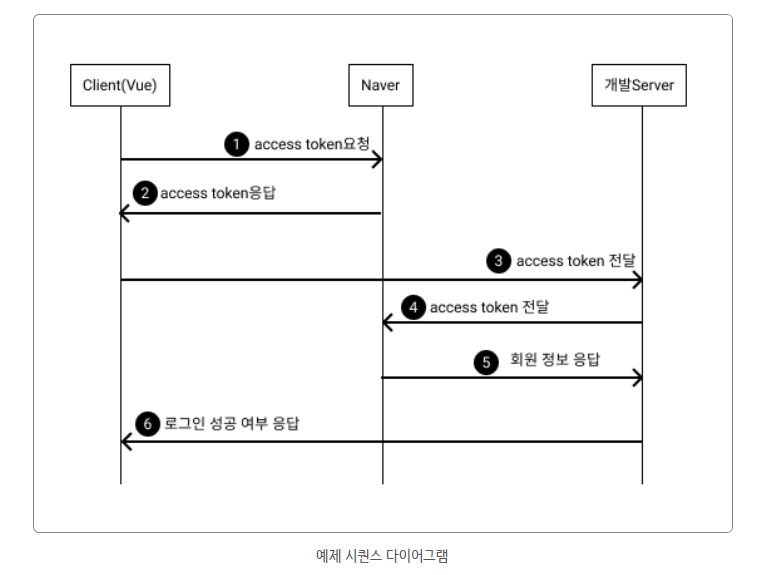
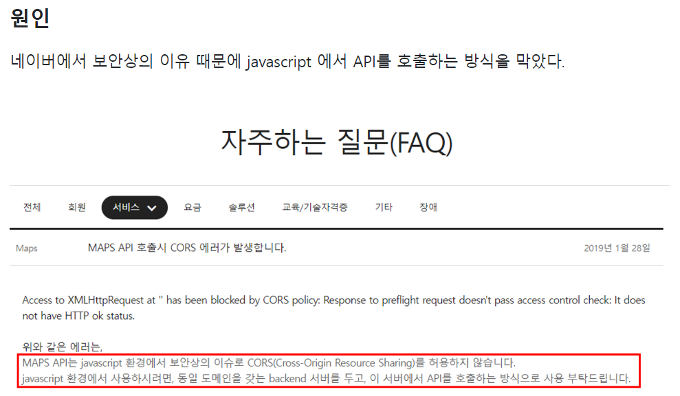

## 네이버 로그인

> [네이버 가이드](https://developers.naver.com/docs/login/devguide/devguide.md)
>
> [참고](https://pygmalion0220.tistory.com/entry/Vue-Naver-%EA%B0%84%ED%8E%B8-%EB%A1%9C%EA%B7%B8%EC%9D%B8-naverLoginimplicit-103js-%EA%B5%AC%ED%98%84#naver-developers)

1. 사용자가 Naver 계정으로 로그인 시 Naver에 access token발급을 요청 한다.
2. Naver는 계정을 확인 후 정상이면 Client에게 access token을 발급 해준다.
   - **현재 개발은 front에서 token과 정보 받는 것 까지.**
3. Client는 개발Server로 access token과 함께 로그인을 요청 한다.
4. 개발Server는 Client에게 전달 받은 access token을 Naver에 정상 token인지 확인 요청 한다.
5. Naver는 token확인 후 정상 token이면 회원 정보를 개발server로 응답 한다.
6. 회원정보를 받은 개발server는 Client의 로그인 요청을 수락 한다.

 

> [네이버 CORS 피하기](https://kkimsangheon.github.io/2021/01/04/naveroauth/)
>
> [CORS2](https://msyu1207.tistory.com/entry/React%EB%A1%9C-%EC%98%81%ED%99%94-%EC%A0%95%EB%B3%B4%EB%A5%BC-%EA%B2%80%EC%83%89%ED%95%B4%EB%B3%B4%EC%9E%90-%EB%91%90%EB%B2%88%EC%A7%B8-%EB%84%A4%EC%9D%B4%EB%B2%84-API-%EC%82%AC%EC%9A%A9-CORS-%EC%84%A4%EC%A0%95-%ED%95%98%EA%B8%B0?category=906762)

> [url 파라미터 파싱](https://gurtn.tistory.com/126)

> [세션토큰&JWT](https://devjem.tistory.com/13)

 

> [프론트만으로 네이버 로그인 구현 불가능](https://velog.io/@ssong/Naver-Geocoding-API-CORS-%EC%97%90%EB%9F%AC-%ED%95%B4%EA%B2%B0)

